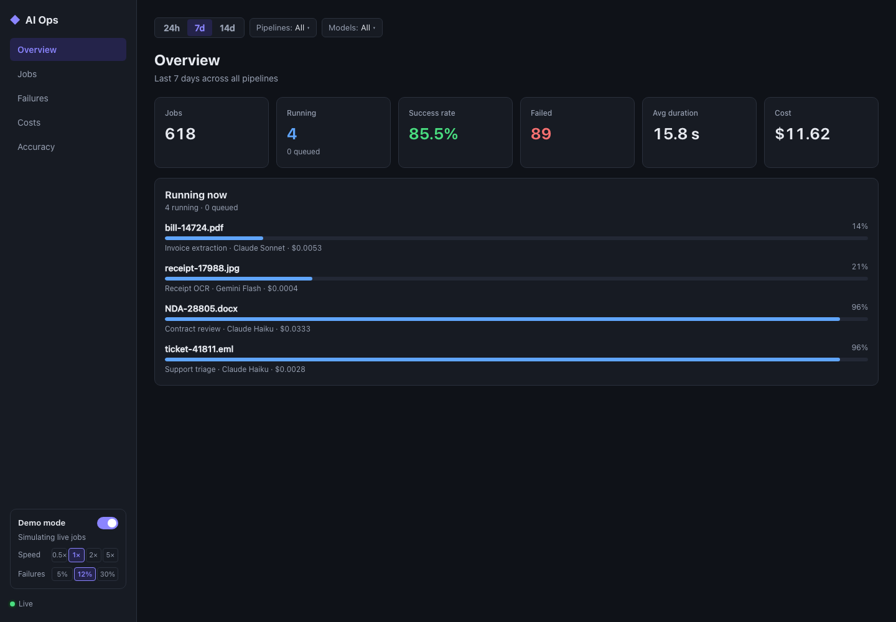
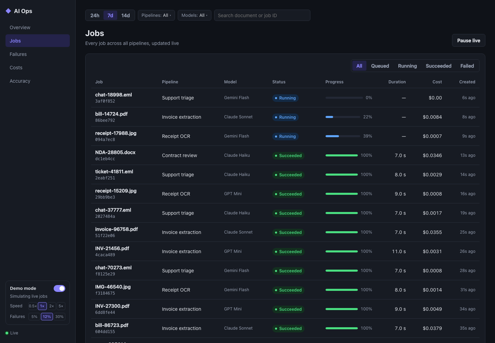
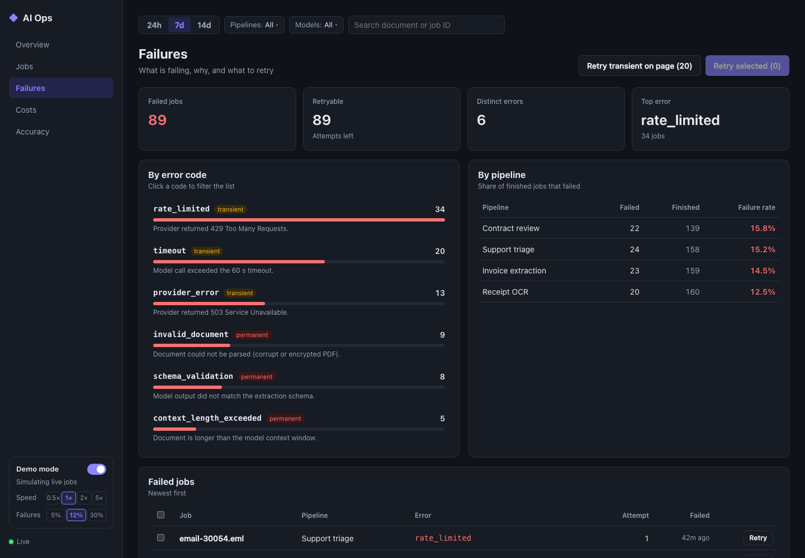
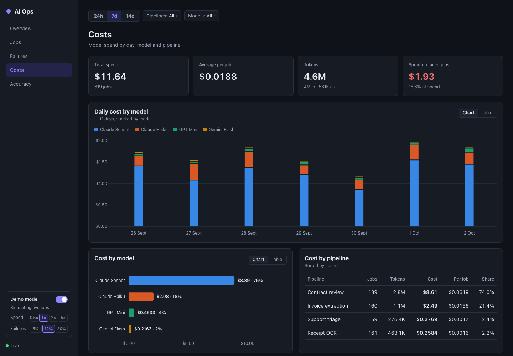
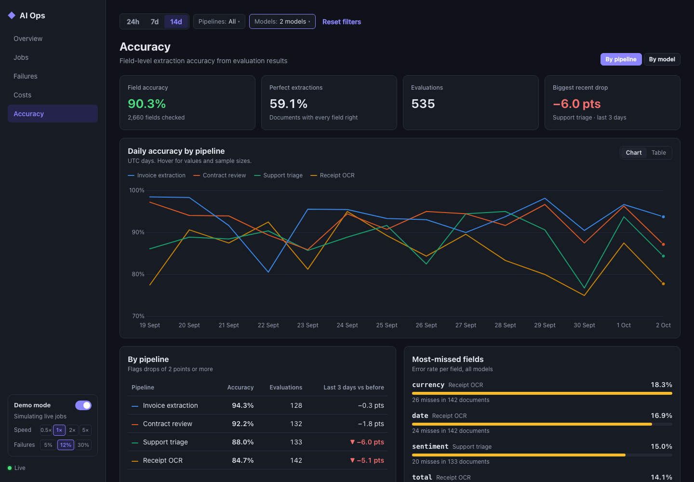

# 📊 AI Ops Dashboard

     

> A live dashboard for monitoring AI processing pipelines: job status, model cost and extraction accuracy in real time.



## 🎯 Why this project

When AI pipelines run in production, operations teams need to see what's happening: which jobs are running, which failed, how much each model costs and how accurate the results are. This dashboard streams live updates from a .NET backend over SignalR.

It uses **synthetic sample data only**. A built-in simulator generates jobs, failures, token usage and evaluation results. It also plants a model regression for you to find.

## ✨ Features

| | |
|---|---|
| **Live jobs** | Every job with status, progress, duration and cost. New jobs stream in over SignalR. You can pause the stream, open a detail panel, and filter by status. |
| **Failures and retry** | Failures grouped by error code (transient or permanent) and failure rate per pipeline. Retry one job, a selection, or every transient failure on the page. Retries are capped at 5 attempts, and cost adds up across attempts. |
| **Costs** | Spend per day stacked by model, cost per model and pipeline, and how much went on failed jobs. |
| **Accuracy** | Field-level accuracy trends from evaluation results, with recent drops flagged and the most-missed fields listed. |
| **Filters** | Date range, pipeline, model and search. The filters live in the URL, so any view can be linked, and they apply on every page. |
| **showcase mode** | Pause or resume the simulator, change its speed (0.5–5×) and failure rate from the sidebar. Changes sync to every open tab. |

<table>
  <tr>
    <td></td>
    <td></td>
  </tr>
  <tr>
    <td></td>
    <td></td>
  </tr>
</table>

## 🚀 Quick start

### Docker

```bash
docker compose up --build
```

Open <http://localhost:8080>. nginx serves the app and proxies `/api` and the SignalR hub to the backend. The API is also published directly on <http://localhost:5080>.

### Local development

```bash
# Backend: http://localhost:5080
cd backend
dotnet run --project src/AiOps.Api

# Frontend: http://localhost:5173 (proxies /api and /hubs to the backend)
cd frontend
npm install
npm run dev
```

Requires the .NET 10 SDK and Node 20.19 or newer.

### Tests

```bash
cd backend && dotnet test              # unit + WebApplicationFactory integration tests
cd frontend && npm test && npm run build
```

CI runs all of these, plus the Docker image builds, on every pull request.

## 🧱 Architecture

```
backend/   ASP.NET Core (.NET 10)
  src/AiOps.Domain          Entities and rules: job lifecycle, retries, evaluations
  src/AiOps.Application     Use cases, ports, DTOs, analytics
  src/AiOps.Infrastructure  In-memory stores, sample catalog, simulator
  src/AiOps.Api             Minimal API endpoints, SignalR hub, composition root
frontend/  Vue 3 + TypeScript + Vite + Pinia
  src/features/<name>       One folder per page: store, components, page
  src/shared/               API client, realtime, filters, charts, UI kit
```

Dependencies point inwards (`Api → Infrastructure → Application → Domain`). Frontend features never import from each other. See [docs/ARCHITECTURE.md](docs/ARCHITECTURE.md) for the full API surface, live update flow, filters and chart conventions.

## 🗺️ Roadmap

- [x] Live job list with status and progress
- [x] Failure view with retry actions
- [x] Cost per model and per day
- [x] Accuracy trends from evaluation results
- [x] Filters by pipeline and date
- [x] showcase mode with simulated jobs

Possible next steps:
- A database-backed store to replace the in-memory one
- Real evaluation ingestion through an API
- Authentication
- Alerts when accuracy drops

---

Built by [Jahanzaib Ahmad](https://github.com/jehanxaibahmed) · Full Stack Engineer · AI & LLM Systems
